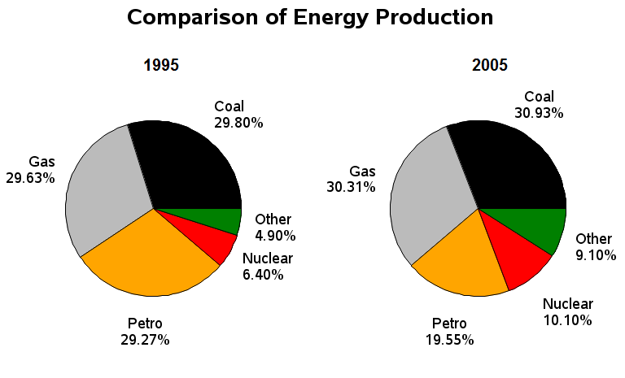

# Writing task 1.
**The pie charts show information about energy production in a country in tow separate years.
Summarize the information by selecting and reporting the main features, and make comparisions where relevant.**
>Write at least 150 words.

***
The pie chart compare the percentage of five different energy sources used to generate energy in Fracne two years, 1995 to 2005.

Overall, the proportion of coal and gas increased slightly over the ten-year period. It is also clear that while nuclear power and other sources grew, the figure for petrol saw a significant decrease.

In 1995, coal was the main sources of energy production at 29.80%. The percentage of gas and petrol sources were very similar, at 29.63% and 29.27%. In contrast, nuclear power and other sources were very much lower, accouting for only 6.4% and 4.9% of total energy in 1995.

By 2005, the figures for coal and gas rose slightly to 30.93% and 30.31%. Similar, nuclear power and other sources also increased to 10.10% and 9.10%. However, the percentage of petrol dropped sharply to only 19.55%, making it the source with the most significant change.